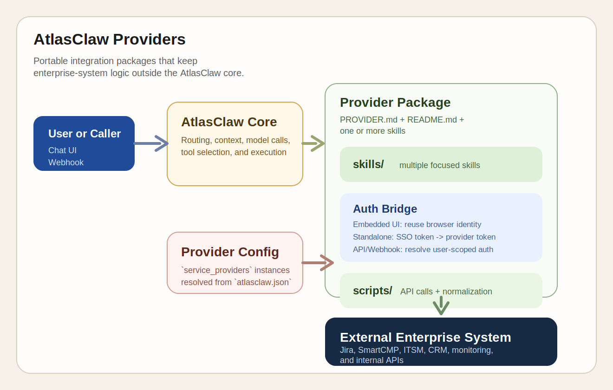

# AtlasClaw Providers

Reusable provider packages and starter patterns for integrating external enterprise systems with AtlasClaw.



## What Is a Provider?

A provider is a self-contained integration package for one external system. It owns:

- connection and authentication conventions
- one or more skills for different business capabilities
- skill definitions exposed to the agent
- executable scripts or handlers that call the target system
- provider-specific documentation and reference material

## What Is in This Repository?

This repository contains reusable provider packages and reference implementations:

| Provider | Purpose | Status |
| --- | --- | --- |
| [`SmartCMP-Provider`](providers/SmartCMP-Provider/README.md) | Cloud resource requests, approval workflows, and reference-data lookup for SmartCMP | Reference implementation |
| [`jira`](providers/jira/README.md) | Jira issue operations and provider wiring patterns | Working example |

If you are new to the model, start with:

1. [`providers/SmartCMP-Provider/README.md`](providers/SmartCMP-Provider/README.md)
2. [`providers/SmartCMP-Provider/PROVIDER.md`](providers/SmartCMP-Provider/PROVIDER.md)
3. [`providers/jira/skills/jira-issue/SKILL.md`](providers/jira/skills/jira-issue/SKILL.md)

## Provider Package Structure

AtlasClaw providers follow a simple package layout:

```text
providers/<provider-name>/
├── PROVIDER.md              # Provider-level configuration and connection contract
├── README.md                # Human-readable overview for developers
└── skills/
    ├── <skill-a>/
    │   ├── SKILL.md         # Skill metadata, trigger rules, entrypoints
    │   ├── scripts/         # Python handlers or helper scripts
    │   └── references/      # Provider-specific API mapping, workflows, examples
    └── <skill-b>/
        └── ...
```

### File Responsibilities

- `PROVIDER.md`: describes configuration shape, auth model, and provider capabilities
- `README.md`: explains the provider to human readers
- `SKILL.md`: declares the skill name, description, provider binding, and executable entrypoints
- `scripts/`: implements the actual integration logic
- `references/`: keeps API mappings, examples, and workflow notes close to the skill

Note: the directory name is a packaging concern, while the runtime identifier comes from `provider_type` in skill metadata and the corresponding key in `service_providers`. In this repository, `SmartCMP-Provider/` maps to the runtime provider type `smartcmp`.

## Authentication Model

Authentication is a provider responsibility. AtlasClaw Core can pass user identity and runtime context, but each provider must obtain or derive credentials that the target system actually accepts.

That matters because one provider usually exposes multiple skills, and all of those skills must execute under the same user identity model for the target system.

### Mode 1: Embedded UI

In embedded deployments, the provider runs inside or alongside the host application's web experience. The browser session already carries user identity information such as:

- session cookies
- host-issued access tokens
- tenant or organization context
- user profile or account identifiers

In this mode, the provider should reuse the host application's existing authenticated context instead of asking the user to sign in again.

### Mode 2: Standalone AtlasClaw Deployment

In standalone deployments, AtlasClaw Core may only hold an enterprise SSO token or upstream identity assertion. That token is not automatically usable against the target platform.

In this mode, the provider must exchange or transform the AtlasClaw-side identity into its own system token, for example by:

- token exchange against the target system
- SSO federation mapping
- backend session bootstrap
- user-scoped API token lookup or minting

The important boundary is: AtlasClaw identifies the user, but the provider is responsible for turning that identity into target-system authentication.

### API Access Must Follow the Same Model

The same rule applies when skills are invoked through API or webhook access rather than a browser UI.

- if the request already includes target-system credentials, the provider must validate and use them safely
- if the request only includes AtlasClaw identity or SSO context, the provider must derive a target-system token before calling the external API
- provider scripts should never assume that AtlasClaw Core has already completed target-system login on their behalf

For external developers, the simplest design rule is:

`every provider skill that calls an external API must run with a provider-native user credential, whether it came from browser context, token exchange, or API-side auth resolution`

## How AtlasClaw Loads Providers

AtlasClaw now loads providers from an external providers repository through `providers_root`.

### 1. Load provider templates and default skills through `providers_root`

Set `providers_root` in `atlasclaw.json` to the directory that contains provider folders such as `jira/` or `SmartCMP-Provider/`.

At startup, AtlasClaw scans `providers_root/<provider>/` for `PROVIDER.md` and loads Markdown skills from `providers_root/<provider>/skills/`.

Example:

```json
{
  "providers_root": "../atlasclaw-providers/providers"
}
```

### 2. Use provider-qualified skills in webhook dispatch

For webhook-driven scenarios, AtlasClaw reuses the provider-qualified Markdown skills already loaded from `providers_root`.
No extra webhook skill path configuration is required.

Example:

```json
{
  "providers_root": "../atlasclaw-providers/providers",
  "webhook": {
    "enabled": true,
    "systems": [
      {
        "system_id": "jira-webhook",
        "enabled": true,
        "sk_env": "JIRA_WEBHOOK_SK",
        "default_agent_id": "main",
        "allowed_skills": ["jira:jira-issue"]
      }
    ]
  }
}
```

Use this mode when the entrypoint is an external system calling AtlasClaw through a webhook, and you want a constrained set of provider-qualified skills such as `jira:jira-issue`.

## Provider Configuration in `atlasclaw.json`

Provider instances are configured under `service_providers`. AtlasClaw resolves environment placeholders such as `${VAR_NAME}` automatically at load time.

```json
{
  "providers_root": "../atlasclaw-providers/providers",
  "service_providers": {
    "jira": {
      "cloud": {
        "base_url": "https://company.atlassian.net",
        "username": "admin@company.com",
        "token": "${JIRA_API_TOKEN}",
        "api_version": "3",
        "default_project": "PROJ"
      }
    },
    "smartcmp": {
      "prod": {
        "base_url": "https://cmp.corp.com/platform-api",
        "cookie": "${CMP_COOKIE}",
        "default_business_group": "47673d8d-6b3f-41e1-8ec0-c37e082d9020"
      }
    }
  }
}
```

Recommended practice:

- keep secrets in environment variables, not committed JSON
- define multiple named instances such as `prod`, `dev`, or `cloud`
- let provider scripts normalize platform-specific fields before returning data to AtlasClaw

## Writing a New Provider

### 1. Start with the provider contract

Create `PROVIDER.md` and document:

- the target system
- required connection parameters
- authentication mode for embedded UI
- authentication mode for standalone deployment
- how API and webhook calls obtain user-scoped target-system credentials
- example `service_providers` configuration
- the list of skills the provider offers

### 2. Define skills in `SKILL.md`

A provider skill is a Markdown file with frontmatter metadata plus usage guidance. For executable skills, AtlasClaw reads tool declarations such as:

```yaml
---
name: "jira-issue"
description: "Jira issue skill for CRUD."
provider_type: "jira"
instance_required: "true"
tool_create_name: "jira_issue_create"
tool_create_entrypoint: "scripts/jira_issue_create.py:handler"
---
```

This pattern keeps the skill readable for both humans and the agent while still binding it to concrete handler code.

### 3. Keep scripts narrow and predictable

Provider scripts should:

- read connection context from provider configuration or runtime context
- resolve or refresh target-system credentials for the current user when needed
- call the external API
- normalize output into stable, agent-friendly fields
- map external errors into actionable messages
- avoid leaking tokens, cookies, or raw secrets into logs

### 4. Add references close to the skill

Put API mappings, workflows, parameter notes, and examples in `references/` so the skill package remains understandable without opening a separate document set.

## Recommended Design Patterns

The SmartCMP reference design in this repository highlights a few patterns worth reusing in new providers:

- dynamic discovery over hardcoded forms when the external platform already exposes schemas or catalogs
- provider-qualified naming to avoid collisions across providers
- one provider with multiple focused skills rather than one oversized general-purpose skill
- read-only lookup skills separated from write or approval skills
- two-step confirmation for risky write operations
- provider-owned user authentication that works consistently across embedded UI, standalone SSO, and API access
- script-level normalization so the LLM sees a stable interface even when the external API is inconsistent

These are design recommendations, not hard requirements for every provider.

## SmartCMP as the Reference Architecture

`SmartCMP-Provider` is the most complete architecture reference in this repository. It demonstrates how to split a provider into business-facing skills instead of one large generic integration:

- `datasource`: read-only reference data lookup
- `request`: resource and application request submission
- `approval`: approval queue actions
- `preapproval-agent`: webhook-oriented review orchestration
- `request-decomposition-agent`: converts free-form demand into structured request candidates

For the architecture rationale behind those boundaries, see:

- [`providers/SmartCMP-Provider/README.md`](providers/SmartCMP-Provider/README.md)
- [`providers/SmartCMP-Provider/PROVIDER.md`](providers/SmartCMP-Provider/PROVIDER.md)

## Recommended Skill Layers

The SmartCMP provider suggests a practical three-layer skill model that works well for most non-trivial providers.

### 1. `datasource` skills

Use a `datasource` skill for read-only data access that other skills depend on.

Typical responsibilities:

- list catalogs, business groups, resource pools, templates, applications, or other reference data
- normalize raw API responses into stable, agent-friendly structures
- provide reusable lookup capability for both end-user conversations and higher-level orchestration skills

This kind of skill is useful in two ways:

- the agent can call it directly when a user needs to explore or inspect data
- other provider skills can rely on it to resolve IDs, validate inputs, and discover valid options before performing writes

If a provider has shared read-only scripts, keep them close to `datasource` or in a shared helper area that `datasource` owns conceptually.

### 2. Module execution skills

Use focused execution skills for concrete operations in each business module.

Examples:

- `request` for provisioning or submission actions
- `approval` for approve/reject/list-pending flows
- `jira-issue` for issue CRUD

These skills should map closely to a stable action surface in the target system. They should:

- perform writes or state changes
- accept already-resolved business inputs
- call provider-native scripts or handlers
- return normalized success and failure results

Do not overload one execution skill with every capability in the system. Split by business module or operation family when that keeps prompts, scripts, and error handling simpler.

### 3. Scenario orchestration skills

Use orchestration skills for end-to-end business scenarios that span multiple module skills.

SmartCMP examples:

- `preapproval-agent`
- `request-decomposition-agent`

These skills should not become a second low-level API layer. Their role is to:

- read context from the request or webhook payload
- call `datasource` skills to gather required data
- call execution skills to perform bounded actions
- apply scenario logic, policy decisions, or decomposition rules

As a rule, orchestration skills should depend on lower-level provider skills instead of re-implementing target-system API logic directly.

### Suggested Provider Composition

For a provider with moderate complexity, the default recommendation is:

- one `datasource` skill layer for read-only access
- several module execution skills for core operations
- zero or more orchestration skills for scenario-specific workflows

This gives the agent both direct data access and reusable business operations, while keeping scenario logic separate from system-specific execution.

## Typical Development Flow

1. Define the provider instance contract in `PROVIDER.md`.
2. Start by identifying the `datasource` layer, module execution skills, and any orchestration scenarios.
3. Implement script entrypoints under each skill package.
4. Configure a test instance in `atlasclaw.json`.
5. Load the provider in AtlasClaw and validate end-to-end prompts against the real system.
6. Add provider-specific examples and failure guidance before sharing with users.

## Repository Layout

```text
atlasclaw-providers/
├── providers/
│   ├── SmartCMP-Provider/
│   └── jira/
├── docs/
│   └── images/
└── README.md
```

## Related Documentation

- [`providers/SmartCMP-Provider/README.md`](providers/SmartCMP-Provider/README.md): SmartCMP package overview
- [`providers/jira/README.md`](providers/jira/README.md): Jira provider example
